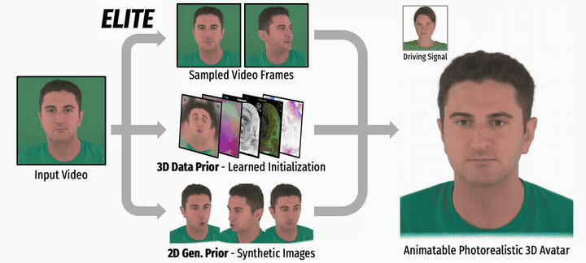

<h2 align="center">ELITE: Efficient Gaussian Head Avatar from a Monocular Video via Learned Initialization and TEst-time Generative Adaptation</h2>

<p align="center">
<a href="https://kim-youwang.github.io"><strong>Kim Youwang</strong></a>
·
<a href="https://hyoseok1223.github.io/"><strong>Lee Hyoseok</strong></a>
·
<a href="https://soobinnpark.github.io/"><strong>Park Subin</strong></a>
·
<a href="https://virtualhumans.mpi-inf.mpg.de/people/pons-moll.html"><strong>Gerard Pons-Moll</strong></a>
·
<a href="https://ami.kaist.ac.kr/members/tae-hyun-oh"><strong>Tae-Hyun Oh</strong></a>
</p>
<h3 align="center">CVPR 2026</h3>


<p align="center">
  <a href="https://kim-youwang.github.io/elite">
    
  </a>
  <a href="https://arxiv.org/abs/2601.10200">
    
  </a>
  <a href="https://www.youtube.com/watch?v=ySBbw85SLqA">
    
  </a>
</p>

<p align="center">
  
</p>


Official implementation of the CVPR 2026 paper, 
"**ELITE**: **E**fficient Gaussian Head Avatar from a Monocular Video via **L**earned **I**nitialization and **TE**st-time Generative Adaptation".


## What's ELITE?
- ELITE is an efficient system for synthesizing high-fidelity, animatable Gaussian avatars from a short monocular video. 
- ELITE leverages a mutually reinforcing synergy of 2D & 3D face priors (generative & data priors) to tackle the longstanding challenge in monocular synthesis of animatable, photorealistic 3D face avatar — Balancing between in-the-wild generalization and efficient synthesis.

## Environment Setup 
Tested on Ubuntu 24.04, NVIDIA RTX A6000 (48GB), CUDA-11.8, gcc-11, g++-11. Later versions should work, but haven't tested.
```bash
git clone git@github.com:kaist-ami/ELITE.git
cd ELITE
git submodule update --init --recursive
export CUDA_HOME=/usr/local/cuda-11.8
export CC=/usr/bin/gcc-11
export CXX=/usr/bin/g++-11
conda create -n ELITE python=3.10
conda activate ELITE
pip install -r requirements.txt
pip install --no-index --no-cache-dir pytorch3d -f https://dl.fbaipublicfiles.com/pytorch3d/packaging/wheels/py310_cu118_pyt201/download.html
CC=gcc-11 CXX=g++-11 pip install --no-build-isolation git+https://github.com/hbb1/diff-surfel-rasterization.git
pip install -e ./vhap
```


## Data preparation & Configuration
### 1. Download ELITE checkpoints
Download ELITE's pre-trained 3D prior model and 2D generative prior model checkpoints from [this link](https://drive.google.com/drive/folders/1GKVymlwRi9shK0G2Qi5JrOFfkIdyUaHM?usp=drive_link). Put the downloaded checkpoints under `checkpoints/{2d_prior,3d_prior}.pth`.

### 2. Download FLAME-relaed assets
Download FLAME related assets from [FLAME](https://flame.is.tue.mpg.de/download.php). Before you continue, you must register at https://flame.is.tue.mpg.de/ and agree to the license terms.

- First download `FLAME 2023 (revised eye region, improved expressions, versions w/ and w/o jaw rotation)` and put it under `asset/flame/flame2023.pkl`. 
- Then, download `FLAME Vertex Masks` and put it under `asset/flame/FLAME_masks.pkl`

### 3. Download INSTA videos
We mainly use monocular videos from [INSTA (Zielonka, CVPR'23)](https://github.com/Zielon/INSTA) dataset and create personalized avatars. Check their instructions and download videos.

### 4. Configure paths (One-time setup)
Open `configs/paths.sh` and edit the variables at the top to match your environment — in particular `CONDA_INIT_SCRIPT` (path to your conda initializer) and `CUDA_HOME`. Then activate the config:
```bash
source configs/paths.sh
```


## ELITE: Build your own 3D animatable head avatar!

ELITE is an end-to-end pipeline to create and render a personalized avatar from a monocular video. 

### Step 0: Prepare source (input) video
Place the input video (e.g., `bala.mp4` from INSTA) at `data/source/input_videos/{ID}.mp4`. A sample input video can be downloaded from [this link](https://drive.google.com/drive/folders/1h2lGlT9MgFCAw0k6RnvLXG8zrtVdiJ3J?usp=drive_link). 
> Note: We currently support two resolutions (`height`x`width`): `512x512` and `802x550`.

### Step 1: Process source video

Runs video preprocessing, face 3DMM tracking, and NeRF/3DGS-format export.

```bash
# bash scripts/process_source_video.sh {ID}
bash scripts/process_source_video.sh bala

# if you want to use specific gpu index
bash scripts/process_source_video.sh bala 4
```

The processed artifacts are saved at:
```
# pre-processed video
data/source/input_videos/{ID}

# 3DMM tracked dataset
data/source/tracked/{ID}_whiteBg_staticOffset

# post-processed data in NeRF/3DGS-format
data/source/processed/{ID}_whiteBg_staticOffset_maskBelowLine  
```

### Step 2: Personalize avatar

Personalize the generalized 3D prior model to the target identity via ELITE's test-time generative adaptation.

```bash
# bash scripts/personalize.sh {ID}
bash scripts/personalize.sh bala

# if you want to use specific gpu index
bash scripts/personalize.sh bala 4
```


### Step 3: Render animated face avatars

Renders the personalized avatar driven by a motion sequence. Please download some preset driver motion sequences from [this link](https://drive.google.com/drive/folders/1xKZMmZG6fLiChSWsvGRYOjl3KVvvRp8b?usp=drive_link), and put them under `data/drive`. 

```bash
# bash scripts/render_videos.sh {ID} {MOTION_NAME}
bash scripts/render_videos.sh bala nersemble_416_EMO-1-shout+laugh

# if you want to use specific gpu index or FPS
bash scripts/render_videos.sh bala nersemble_416_EMO-1-shout+laugh 4 30
```

If you want to use your own motion sequence for a driving signal, you can run the preprocessing scripts from the Step 1 (`scripts/process_source_video.sh`) and put the "processed" data directories under `data/drive`.

The rendered output videos are saved at:
```
outputs/{ID}/vis_motion/{ID}_rgb_{MOTION_NAME}.mp4   # RGB render
outputs/{ID}/vis_motion/{ID}_nrm_{MOTION_NAME}.mp4   # Normal map render
```


## Citation
If you find our code or paper helps, please consider citing:
````BibTeX
@inproceedings{youwang2026elite,
    title = {ELITE: Efficient Gaussian Head Avatar from a Monocular Video via Learned Initialization and TEst-time Generative Adaptation},
    author = {Youwang, Kim and Hyoseok, Lee and Subin, Park and Pons-Moll, Gerard and Oh, Tae-Hyun},
    booktitle = {CVPR},
    year = {2026}
}
````


## Contact
Kim Youwang (youwang.kim@postech.ac.kr)


